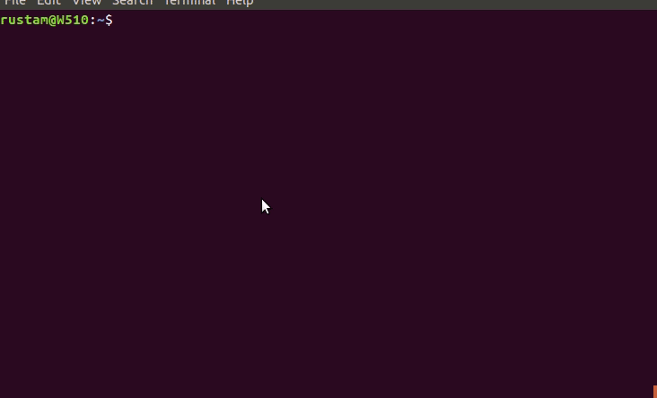

# Workplaces

Scripts to setup workplace (tools for frontend, DevOps development, etc).

## Developing, Testing, Running this repo

See details on installing and configuring prerequisites [here](/bootstrap/README.md).

See details about testing [here](tests/README.md).

Run playbooks locally:
```bash
$ ansible-playbook -c local -i default, playbook.yml
```

## Frontend workplace

The following toolset will be installed (if not installed yet):

* NodeJs and NPM
* git
* Angular-CLI
* VSCode

How to install:

1. Install [ansible](https://docs.ansible.com/ansible/latest/installation_guide/intro_installation.html), e.g.:
```
    apt-get update
    apt-get install software-properties-common
    apt-add-repository ppa:ansible/ansible
    apt-get update
    apt-get install -y ansible
```
2. Run as a root to install to localhost:
```
    curl -s "https://raw.githubusercontent.com/rustamkulenov/workplace/master/frontend/setup.sh" | sudo bash -s
```
Or, if you want to install to multiple machines, then run:
```
    git clone https://github.com/rustamkulenov/workplace.git
    cd workplace
    ansible-playbook frontend/angular/playbook.yml -i <your_inventory_file>
```
See [ansible documentation](https://docs.ansible.com/ansible/latest/user_guide/intro_inventory.html) for inventory file format.

